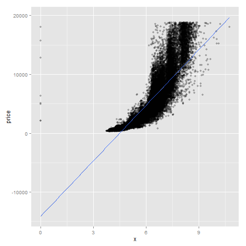

% Hausaufgabe 16
% Isabel Schiller <Schillei@students.uni-marburg.de>
% 2014-06-14

Falls die Umlaute in dieser und anderen Dateien nicht korrekt dargestellt werden, sollten Sie File > Reopen with Encoding > UTF-8 sofort machen (und auf jeden Fall ohne davor zu speichern), damit die Enkodierung korrekt erkannt wird! 


# Die nächsten Punkte sollten beinahe automatisch sein...
1. Kopieren Sie diese Datei in Ihren Ordner (das können Sie innerhalb RStudio machen oder mit Explorer/Finder/usw.) und öffnen Sie die Kopie. Ab diesem Punkt arbeiten Sie mit der Kopie. Die Kopie bitte `hausaufgabe16.Rmd` nennen und nicht `Kopie...`
2. Sie sehen jetzt im Git-Tab, dass die neue Datei als unbekannt (mit gelbem Fragezeichen) da steht. Geben Sie Git Bescheid, dass Sie die Änderungen in der Datei verfolgen möchten (auf Stage klicken).
3. Machen Sie ein Commit mit den bisherigen Änderungen (schreiben Sie eine sinnvolle Message dazu -- sinnvoll bedeutet nicht unbedingt lang) und danach einen Push.
4. Ersetzen Sie meinen Namen oben mit Ihrem. Klicken auf Stage, um die Änderung zu merken.
5. Ändern Sie das Datum auf heute. (Seien Sie ehrlich! Ich kann das sowieso am Commit sehen.)
6. Sie sehen jetzt, dass es zwei Symbole in der Status-Spalte gibt, eins für den Zustand im *Staging Area* (auch als *Index* bekannt), eins für den Zustand im Vergleich zum Staging Area. Sie haben die Datei modifiziert, eine Änderung in das Staging Area aufgenommen, und danach weitere Änderungen gemacht. Nur Änderungen im Staging Area werden in den Commit aufgenommen.
7. Stellen Sie die letzten Änderungen auch ins Staging Area und machen Sie einen Commit (immer mit sinnvoller Message!).
8. Vergessen Sie nicht am Ende, die Lizenz ggf. zu ändern!

# Diamonds are forever 
Bisher haben Sie von mir mehr oder weniger vollständige Analysen bekommen, bei denen Sie im Prinzip nur einzelne Schritte einfügen müssten. Es wird allerdings langsam Zeit, dass Sie eine eigenständige Analyse ausführen. Sie haben das bei der Analyse vom Priming Experiment mittels ANOVA fast gemacht, aber auch da haben Sie viel von mir vorgefertigt bekommen. Für die Aufgaben heute werden Sie den Datensatz `diamonds` aus `ggplot2` bearbeiten. Schauen Sie sich die Beschreibung des Datensatzes an


```r
`?`(diamonds)
```

<div style="border: 2px solid black; padding: 5px; font-size: 80%;">
<!DOCTYPE html PUBLIC "-//W3C//DTD HTML 4.01 Transitional//EN">
<html><head><title>R: Prices of 50,000 round cut diamonds</title>
<meta http-equiv="Content-Type" content="text/html; charset=utf-8">
<link rel="stylesheet" type="text/css" href="">
</head><body>

<table width="100%" summary="page for diamonds"><tr><td>diamonds</td><td align="right">R Documentation</td></tr></table>

<h2>Prices of 50,000 round cut diamonds</h2>

<h3>Description</h3>

<p>A dataset containing the prices and other attributes of
almost 54,000 diamonds. The variables are as follows:
</p>


<h3>Format</h3>

<p>A data frame with 53940 rows and 10 variables</p>


<h3>Details</h3>

 <ul>
<li><p> price. price in US dollars
(\$326&ndash;\$18,823) </p>
</li>
<li><p> carat. weight of the diamond
(0.2&ndash;5.01) </p>
</li>
<li><p> cut. quality of the cut (Fair, Good,
Very Good, Premium, Ideal) </p>
</li>
<li><p> colour. diamond colour,
from J (worst) to D (best) </p>
</li>
<li><p> clarity. a measurement
of how clear the diamond is (I1 (worst), SI1, SI2, VS1,
VS2, VVS1, VVS2, IF (best)) </p>
</li>
<li><p> x. length in mm
(0&ndash;10.74) </p>
</li>
<li><p> y. width in mm (0&ndash;58.9) </p>
</li>
<li><p> z. depth
in mm (0&ndash;31.8) </p>
</li>
<li><p> depth. total depth percentage = z /
mean(x, y) = 2 * z / (x + y) (43&ndash;79) </p>
</li>
<li><p> table. width
of top of diamond relative to widest point (43&ndash;95) </p>
</li></ul>


</body></html>

</div>

Die Aufgabe ist: eine Ausgangsfrage und die darauf folgenden Anschlussfragen statistisch zu beantworten. Sie können auch einige kleinere Fragen als Gruppe behandeln. Sie haben frei Wahl von Methoden und Fragen, aber sie müssen natürlich zueinander passen!

Mögliche Ausgangsfragen sind unter anderem:

* Was bestimmt den Preis eines Diamenten?
* Was bestimmt das Gewicht eines Diamenten? Hat Farbe oder Klarheit eine Auswirkung daruf oder bloß Volumen?
* Gibt es einen Zusammenhang zwischen den verschieden Dimensionen ("Längen")? 
* Gibt es einen Zusammenhang zwischen Farbe und Klarheit? Zwischen Farbe und Carat? Zwischen Farbe und Tiefe?
* ...

*Vergessen Sie dabei nicht, dass wir bisher nur Methoden gelernt haben, wo die abhängige Variable zumindest intervallskaliert ist!*

Sie können sich auch [das *ggplot* Buch](http://dx.doi.org/10.1007/978-0-387-98141-3) zur Inspiration anschauen, v.a. Abbildungen 4.7, 4.8, 4.9, 5.2, 5.3, 5.4, 5.6, 5.14, 7.16, 9.1  und Kapitel 2.2-2.5 könnten inspirierend wirken. Den Code zur Erstellung der Figuren findet man immer im Haupttext.

**Originale Fragestellungen und Auswertungen werden mit Bonuspunkten belohnt!** 

Hier ein paar Grafiken (auch im Buch zu finden):

```r
ggplot(diamonds, aes(x = carat, y = price, color = color)) + geom_point()
```

 

```r
ggplot(diamonds, aes(x = carat, y = price, color = color)) + geom_point(alpha = 0.3)
```

 

```r
ggplot(diamonds, aes(x = carat, y = price, color = color)) + geom_point() + 
    facet_wrap(~color)
```

 


# Noch eine Überlegung
Haben Sie dabei explorativ oder konfirmativ gearbeitet? Was hat das für eine Auswirkung 
auf die Interpretation der Ergebnisse?

# Analyse
Fragestellung: Was bestimmt den Preis eines Diamanten?

abhängige Variable: 
- metrisch: price

unabhängige Variablen: 
- nominal: clarity, cut, color
- metrisch: carat, depth, table, x, y, z

Erst mal schauen, wie die Einflüsse der unterschiedlichen Variablen auf den Preis 
aussehen:

```r
# Einfluss von Karat
ggplot(diamonds, aes(x = carat, y = price)) + geom_point(alpha = 0.3) + geom_smooth(method = "lm")
```

 

```r
# Offenbar hat Karat einen großen Einfluss auf den Preis.Je mehr Karat,
# desto höher der Preis, auch wenn es eine recht hohe Streuung gibt.

# Einfluss von Farbe
ggplot(data = diamonds) + geom_violin(aes(x = color, y = price, color = color, 
    fill = color), alpha = 0.3)
```

 

```r
# Offenbar hat die Farbe kaum einen Einfluss auf den Preis. Die Farben 1,2
# und 3 scheinen jedoch im großen und ganzen eher günstiger zu sein. In den
# höheren Preiskategorien sind eher die Farben 6 und 7 anzuordnen, während
# 3, 4 und 5 dazwischen liegen.

# Einfluss von Schnitt
ggplot(data = diamonds) + geom_violin(aes(x = cut, y = price, color = cut, fill = cut), 
    alpha = 0.3)
```

 

```r
# Es sieht so aus, als besteht ein gewisser Zusammenhang zw. Schnitt und
# Preis. die Schnitte very good, premium und ideal sind eher in der höheren
# Preissegmenten vertretet als die Schnitte fair und good. Da es jedoch
# vergleichsweise wenig teure Diamanten gibt, lässt sich die Grafik nur grob
# interpretieren.

# Einfluss von Klarheit
ggplot(data = diamonds) + geom_violin(aes(x = clarity, y = price, color = clarity, 
    fill = clarity), alpha = 0.3)
```

 

```r
# Auch der Einfluss der Klarheit ist gering. Es ist jedoch schwer zu
# beurteilen, da es sicherlich viel weniger teure als günstige Diamanten
# gibt und sich die Grafik (wie auch die vorherige) daher schwer beurteilen
# lässt.

# Einfluss von Tiefe
ggplot(diamonds, aes(x = depth, y = price)) + geom_point(alpha = 0.3) + geom_smooth(method = "lm")
```

 

```r
# Der Einfluss der Tiefe sieht ebenfalls gering aus. Die Regressionsgerade
# ist beinahe horizontal.

# Einfluss von Table (was auch immer das ist)
ggplot(diamonds, aes(x = table, y = price)) + geom_point(alpha = 0.3) + geom_smooth(method = "lm")
```

 

```r
# Was ist das denn? Die Gerade ist toll, aber die Punkte sind doch ganz
# anders verteilt.  Kann ich mir nicht erklären.Eigentlich sind die Punkte
# doch ähnlich verteilt wie bei der Variablen Table und trotzdem sieht die
# Regressionsgerade so anders aus.

# Einfluss von x
ggplot(diamonds, aes(x = x, y = price)) + geom_point(alpha = 0.3) + geom_smooth(method = "lm")
```

 

```r
# Hier besteht ein Zusammenhang. Je größer die Länge der Diamanten, desto
# teurer sind sie auch.

# Einfluss von y
ggplot(diamonds, aes(x = y, y = price)) + geom_point(alpha = 0.3) + geom_smooth(method = "lm")
```

 

```r
# Auch hier besteht ein Zusammenhang. Allerdings gibt es überhaupt keine
# Datenpunkte für die höheren Preisklassen, was ich mir nicht erklären kann

# Einfluss von z
ggplot(diamonds, aes(x = z, y = price)) + geom_point(alpha = 0.3) + geom_smooth(method = "lm")
```

 

```r
# Auch hier besteht ein Zusammenhang. Es besteht allerdings das gleiche
# Problem wie bei Variable y.
```


 
Die Grafiken haben gezeigt, dass besonders Karat und Länge eine großen Einfluss auf den Preis
eines Diamanten haben. Deshalb soll im Folgenden überprüft werden, ob dieser Einfluss auch
statistisch belegt werden kann. Da Karat und x metrische Variablen sind, bietet sich eine
Regression an:


```r
# zunächst betrachten wir den Einfluss von Karat und der Länge einzeln:
summary(lm(price ~ carat, data = diamonds))
```

```
## 
## Call:
## lm(formula = price ~ carat, data = diamonds)
## 
## Residuals:
##    Min     1Q Median     3Q    Max 
## -18585   -805    -19    537  12732 
## 
## Coefficients:
##             Estimate Std. Error t value Pr(>|t|)    
## (Intercept)  -2256.4       13.1    -173   <2e-16 ***
## carat         7756.4       14.1     551   <2e-16 ***
## ---
## Signif. codes:  0 '***' 0.001 '**' 0.01 '*' 0.05 '.' 0.1 ' ' 1
## 
## Residual standard error: 1550 on 53938 degrees of freedom
## Multiple R-squared:  0.849,	Adjusted R-squared:  0.849 
## F-statistic: 3.04e+05 on 1 and 53938 DF,  p-value: <2e-16
```

```r
# Das Ergebnis ist signifikant. Der Preis wird durch Karat bedingt. Das
# Modell erklärt etwa 85% der Varianz.
summary(lm(price ~ x, data = diamonds))
```

```
## 
## Call:
## lm(formula = price ~ x, data = diamonds)
## 
## Residuals:
##    Min     1Q Median     3Q    Max 
##  -8426  -1264   -185    973  32128 
## 
## Coefficients:
##              Estimate Std. Error t value Pr(>|t|)    
## (Intercept) -14094.06      41.73    -338   <2e-16 ***
## x             3145.41       7.15     440   <2e-16 ***
## ---
## Signif. codes:  0 '***' 0.001 '**' 0.01 '*' 0.05 '.' 0.1 ' ' 1
## 
## Residual standard error: 1860 on 53938 degrees of freedom
## Multiple R-squared:  0.782,	Adjusted R-squared:  0.782 
## F-statistic: 1.94e+05 on 1 and 53938 DF,  p-value: <2e-16
```

```r
# Auch dieses Ergebnis ist signifikant. Die Länge erklärt 78% der Varianz.
# Seltsam finde ich, dass die Steigung negativ ist, was ja bedeuten würde:
# je geringer die Länge, desto höher der Preis.

# Was ändert sich, wenn wir beide Variablen einbeziehen?
summary(lm(price ~ carat + x, data = diamonds))
```

```
## 
## Call:
## lm(formula = price ~ carat + x, data = diamonds)
## 
## Residuals:
##    Min     1Q Median     3Q    Max 
## -23423   -654    -14    371  12978 
## 
## Coefficients:
##             Estimate Std. Error t value Pr(>|t|)    
## (Intercept)   1737.9      103.6    16.8   <2e-16 ***
## carat        10126.0       62.6   161.9   <2e-16 ***
## x            -1026.9       26.4   -38.9   <2e-16 ***
## ---
## Signif. codes:  0 '***' 0.001 '**' 0.01 '*' 0.05 '.' 0.1 ' ' 1
## 
## Residual standard error: 1530 on 53937 degrees of freedom
## Multiple R-squared:  0.853,	Adjusted R-squared:  0.853 
## F-statistic: 1.57e+05 on 2 and 53937 DF,  p-value: <2e-16
```

```r
# Zusammen erklären die Variablen 85% der Varianz, was keinen Unterschied
# zur Berechnung von Karat allein ergibt. Heißt das nun, dass der Einfluss
# von Länge sehr gering ist?  Oder dass Länge und Karat unmittelbar zusammen
# hängen? Um diese Frage zu überprüfen, schauen wir uns die Interaktion
# beider Variablen an:
summary(lm(price ~ carat * x, data = diamonds))
```

```
## 
## Call:
## lm(formula = price ~ carat * x, data = diamonds)
## 
## Residuals:
##    Min     1Q Median     3Q    Max 
## -26116   -634    -31    342  13004 
## 
## Coefficients:
##             Estimate Std. Error t value Pr(>|t|)    
## (Intercept)    616.7      120.0    5.14  2.8e-07 ***
## carat         5919.0      237.7   24.90  < 2e-16 ***
## x             -576.6       36.0  -16.01  < 2e-16 ***
## carat:x        372.7       20.3   18.34  < 2e-16 ***
## ---
## Signif. codes:  0 '***' 0.001 '**' 0.01 '*' 0.05 '.' 0.1 ' ' 1
## 
## Residual standard error: 1520 on 53936 degrees of freedom
## Multiple R-squared:  0.854,	Adjusted R-squared:  0.854 
## F-statistic: 1.05e+05 on 3 and 53936 DF,  p-value: <2e-16
```

```r
# Da für die Interaktion p < 0.05 berechnet wird, ist das Ergebnis
# signifikant: Länge und Karat interagieren mit einander und beeinflussen
# den Preis. Der r^2 Wert ändert sich jedoch nicht. Woran liegt das?
```

Aus den Ergebnissen lässt sich schließen, dass Karat einen größeren Einfluss auf den
Preis hat, als die Länge der Diamanten. Je mehr Karat, desto teurer ist ein Diamant.
Zwischen Länge und Karat besteht eine signifikante Interaktion, die ich allerdings
nicht näher beschreiben kann.

Um nun zu schauen, ob auch die nominal skalierten Variablen einen Einfluss auf den Preis 
haben rechnen wir ANOVAs:

```r
# Ist der Einfluss von Farbe signifikant?
summary(aov(price ~ color, data = diamonds))
```

```
##                Df   Sum Sq  Mean Sq F value Pr(>F)    
## color           6 2.68e+10 4.47e+09     290 <2e-16 ***
## Residuals   53933 8.32e+11 1.54e+07                   
## ---
## Signif. codes:  0 '***' 0.001 '**' 0.01 '*' 0.05 '.' 0.1 ' ' 1
```

```r
# Da p < 0.05 hat die Farbe einen signifikanten Einfluss auf den Preis. Das
# hätte ich nach einem Blick auf den Plot nicht vermutet.

# Ist der Einfluss vom Schnitt signifikant?
summary(aov(price ~ cut, data = diamonds))
```

```
##                Df   Sum Sq  Mean Sq F value Pr(>F)    
## cut             4 1.10e+10 2.76e+09     176 <2e-16 ***
## Residuals   53935 8.47e+11 1.57e+07                   
## ---
## Signif. codes:  0 '***' 0.001 '**' 0.01 '*' 0.05 '.' 0.1 ' ' 1
```

```r
# Auch dieser Einfluss ist signifikant. Das hatte ich bereits nach dem
# plotten vermutet.

# Ist der Einfluss von Klarheit signifikant?
summary(aov(price ~ clarity, data = diamonds))
```

```
##                Df   Sum Sq  Mean Sq F value Pr(>F)    
## clarity         7 2.33e+10 3.33e+09     215 <2e-16 ***
## Residuals   53932 8.35e+11 1.55e+07                   
## ---
## Signif. codes:  0 '***' 0.001 '**' 0.01 '*' 0.05 '.' 0.1 ' ' 1
```

```r
# nach der ANOVA schon

# Wie sieht es aus, wenn wir Klarheit als metrisch betrachten?
clarityNUM <- as.numeric(diamonds$clarity)
summary(lm(price ~ clarityNUM, data = diamonds))
```

```
## 
## Call:
## lm(formula = price ~ clarityNUM, data = diamonds)
## 
## Residuals:
##    Min     1Q Median     3Q    Max 
##  -4673  -2673  -1466   1151  16277 
## 
## Coefficients:
##             Estimate Std. Error t value Pr(>|t|)    
## (Intercept)   5373.2       45.1   119.1   <2e-16 ***
## clarityNUM    -355.6       10.3   -34.5   <2e-16 ***
## ---
## Signif. codes:  0 '***' 0.001 '**' 0.01 '*' 0.05 '.' 0.1 ' ' 1
## 
## Residual standard error: 3950 on 53938 degrees of freedom
## Multiple R-squared:  0.0216,	Adjusted R-squared:  0.0215 
## F-statistic: 1.19e+03 on 1 and 53938 DF,  p-value: <2e-16
```

```r
# Es zeigt sich, dass der Einfluss von Klarheit zwar signifikant ist, jedoch
# nur ca. 2% der Varianz erklärt. Die Koeffizienten zeigen, dass die
# Steigung negativ ist. Offenbar führt der Befehl as.numeric dazu, dass den
# Faktorstufen willkürlich Zahlen zugewiesen werden. Diesen Zahlen liegt
# aber keine Rangordnung zugrunde, weshalb dieser Befehl (und folglich auch
# die Regression) sind sinnvoll ist.

# Welchen Einfluss hat die Tiefe?
summary(lm(price ~ depth, data = diamonds))
```

```
## 
## Call:
## lm(formula = price ~ depth, data = diamonds)
## 
## Residuals:
##    Min     1Q Median     3Q    Max 
##  -3766  -2986  -1521   1396  14937 
## 
## Coefficients:
##             Estimate Std. Error t value Pr(>|t|)    
## (Intercept)   5763.7      740.6    7.78  7.2e-15 ***
## depth          -29.6       12.0   -2.47    0.013 *  
## ---
## Signif. codes:  0 '***' 0.001 '**' 0.01 '*' 0.05 '.' 0.1 ' ' 1
## 
## Residual standard error: 3990 on 53938 degrees of freedom
## Multiple R-squared:  0.000113,	Adjusted R-squared:  9.48e-05 
## F-statistic: 6.12 on 1 and 53938 DF,  p-value: 0.0134
```

```r
# Obwohl sich beim Plot eine beinahe horizontale Regressionsgerade gezeigt
# hat, hat die Tiefe dieser Berechnung zufolge einen signifikanten Einfluss
# auf den Preis. Sie erklärt jedoch nur 0,01% der Variation, was sehr wenig
# ist.

# Welchen Einfluss hat Table?
summary(lm(price ~ table, data = diamonds))
```

```
## 
## Call:
## lm(formula = price ~ table, data = diamonds)
## 
## Residuals:
##    Min     1Q Median     3Q    Max 
##  -6522  -2751  -1490   1368  15746 
## 
## Coefficients:
##             Estimate Std. Error t value Pr(>|t|)    
## (Intercept) -9109.05     438.45   -20.8   <2e-16 ***
## table         226.98       7.63    29.8   <2e-16 ***
## ---
## Signif. codes:  0 '***' 0.001 '**' 0.01 '*' 0.05 '.' 0.1 ' ' 1
## 
## Residual standard error: 3960 on 53938 degrees of freedom
## Multiple R-squared:  0.0162,	Adjusted R-squared:  0.0161 
## F-statistic:  886 on 1 and 53938 DF,  p-value: <2e-16
```

```r
# Der Einfluss von Table ist signifikant, doch auch diese Variable erklärt
# nur ca.  2% der Varianz.

# Welche Einfluss hat die Breite
summary(lm(price ~ y, data = diamonds))
```

```
## 
## Call:
## lm(formula = price ~ y, data = diamonds)
## 
## Residuals:
##     Min      1Q  Median      3Q     Max 
## -152436   -1229    -241     838   31436 
## 
## Coefficients:
##              Estimate Std. Error t value Pr(>|t|)    
## (Intercept) -13402.03      44.06    -304   <2e-16 ***
## y             3022.89       7.54     401   <2e-16 ***
## ---
## Signif. codes:  0 '***' 0.001 '**' 0.01 '*' 0.05 '.' 0.1 ' ' 1
## 
## Residual standard error: 2000 on 53938 degrees of freedom
## Multiple R-squared:  0.749,	Adjusted R-squared:  0.749 
## F-statistic: 1.61e+05 on 1 and 53938 DF,  p-value: <2e-16
```

```r
# Breite hat einen signifikanten Einfluss auf den Preis und erklärt immerhin
# ca.  75% der Varianz. Je breiter ein Diamant, desto teurer ist er.

# Welchen Einfluss hat Tiefe (mm)?
summary(lm(price ~ z, data = diamonds))
```

```
## 
## Call:
## lm(formula = price ~ z, data = diamonds)
## 
## Residuals:
##     Min      1Q  Median      3Q     Max 
## -139561   -1235    -240     825   32085 
## 
## Coefficients:
##             Estimate Std. Error t value Pr(>|t|)    
## (Intercept) -13296.6       44.6    -298   <2e-16 ***
## z             4868.8       12.4     394   <2e-16 ***
## ---
## Signif. codes:  0 '***' 0.001 '**' 0.01 '*' 0.05 '.' 0.1 ' ' 1
## 
## Residual standard error: 2030 on 53938 degrees of freedom
## Multiple R-squared:  0.742,	Adjusted R-squared:  0.742 
## F-statistic: 1.55e+05 on 1 and 53938 DF,  p-value: <2e-16
```

```r
# Tiefe hat einen signifikanten Einfluss auf den Preis und erklärt ca. 74%
# der Varianz.

# Mal sehen wie viel Varianz durch die Interaktion von x, y, und z erklärt
# wird
summary(lm(price ~ x * y * z, data = diamonds))
```

```
## 
## Call:
## lm(formula = price ~ x * y * z, data = diamonds)
## 
## Residuals:
##    Min     1Q Median     3Q    Max 
## -18839   -530    -30    293  12766 
## 
## Coefficients:
##             Estimate Std. Error t value Pr(>|t|)    
## (Intercept) 20969.40     448.20   46.79  < 2e-16 ***
## x           -8027.66     148.87  -53.92  < 2e-16 ***
## y           -1341.67     156.24   -8.59  < 2e-16 ***
## z           -1769.78     226.31   -7.82  5.4e-15 ***
## x:y          1029.19      21.91   46.97  < 2e-16 ***
## x:z          1125.68      26.02   43.27  < 2e-16 ***
## y:z          -378.62      35.93  -10.54  < 2e-16 ***
## x:y:z         -60.86       3.31  -18.40  < 2e-16 ***
## ---
## Signif. codes:  0 '***' 0.001 '**' 0.01 '*' 0.05 '.' 0.1 ' ' 1
## 
## Residual standard error: 1470 on 53932 degrees of freedom
## Multiple R-squared:  0.864,	Adjusted R-squared:  0.864 
## F-statistic: 4.89e+04 on 7 and 53932 DF,  p-value: <2e-16
```

```r
# Länge, Breite und Tiefe erklären ca. 86% der Varianz (etwa genauso viel,
# wie durch Karat erklärt wird). Da das Gewicht von Diamanten natrlich von
# ihrer Größe abhängt, ist dieses Ergebnis nicht verwunderlich.
```


# Ergebnisse

- Karat und dier Interaktion aus Länge, Breite und Tiefe der Diamanten haben den größten Einfluss auf den Preis. Sie erklären die meiste Varianz (85% und 86%).
- Dennoch haben alle untersuchten Variablen einen signifikaten Einfluss auf den Preis der Diamanten, obwohl sie mehr oder weniger viel Varianz erklären.

# Fazit

- Interpretation der Plots schwierig und nicht immer übereinstimmend mit den statistischen Ergebnissen. 
- keine Erklärung dafür warum die Plots von x und y so merkwürdig aussehen. Warum sind keinerlei Werte in den höheren Preiskategorien?
- Die Einschätzung, dass die nominalskalierten Variablen nur wenig Varianz erklären beruht allein auf den Plots, da die ANOVA keinen r^2 Wert ausgibt.
- Offenbar ist der Einfluss von Variablen bereits relevant, wenn diese nur eine sehr geringen Teil der Varianz erklären. Das wundert mich.

# Was unbeantwortet bleibt
- wie viel Varianz erklären die nominal skalierten Daten?
- Warum ist die Steigung der Koeffizienten z.T. negativ (z.B. bei der Interaktion von x, y und z)?
- Wir wissen zwar nun, dass Karat und die Interaktion von x,y und z den größten Einfluss auf den Preis haben, aber nicht, wie dieser Einfluss eigentlich konkret aussieht.

# Lizenz
Dieses Werk ist lizenziert unter einer CC-BY-NC-SA Lizenz. Diese Datei darf als Beispiel verwendet werden.
